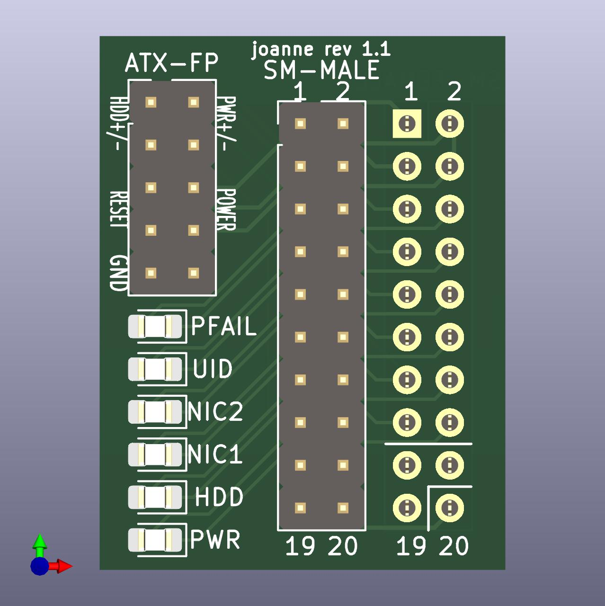

# supermicro-front-panel
A simple KiCad project to break out a Supermicro motherboard header into its corresponding ATX pinout.

## BOM / Parts List

| Count | Part |
| --- | --- |
| 6 | 0805 SMD LEDs | 
| 1 | 2x5 2.54mm vertical pin header, male | 
| 1 | 2x10 2.54mm vertical pin header, male | 
| 1 | 2x10 2.54mm vertical pin header, female | 
